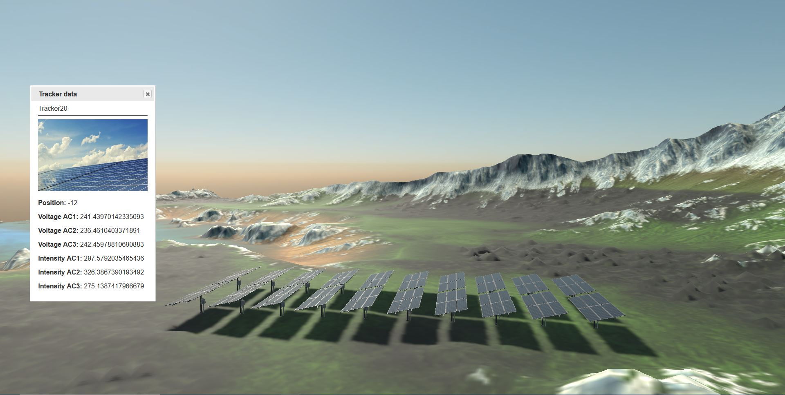

# Digital Twin Demo
Digital Twin application sample based on a solar energy field. It simulates a time lapse and how
users could check different measurements related to tracker angles, voltage or intensity.



## Build and Test
- Required Visual Studio 16.8 with .NET5 support
- For web solution: WSL 2 with Ubuntu 18.04 LTS

## Working with Wave Engine for web
Default launcher for web platform is an ASP.Net Core project. First time you run a Wave Engine web sample from Visual Studio, it may take some time as it needs to download mono-wasm and mono-wasm AOT.

In a clean machine without all dependencies installed, you may encounter some errors before being able to launch the sample.

_**I get an error like Error MSB4018: System.InvalidCastException**_
Complete error message should be something like this

```Error MSB4018: System.InvalidCastException: The Windows Subsystem for Linux is not installed, please install Ubuntu 18.04 by visiting https://docs.microsoft.com/en-us/windows/wsl/install-win10.```

Solution is simple, just install WSL2 as indicated in https://docs.microsoft.com/en-us/windows/wsl/install-win10. You need to install WSL 2 and install Ubuntu 18.04.

_**I get an error like "The Windows Subsystem for Linux dotnet environment may not be properly setup, and you may need to run the environment setup script. Open an Ubuntu WSL shell and run"**_

In output, you can also see that you need to run a comand from Ubuntu shell. 
```
`wslpath "C:\Users\sescalada\.nuget\packages\waveengine.targets.web\3.1.0.7397-nightly\build\scripts\dotnet-setup.sh"`
```
**Notice that you should run the command with back quotes**

This command installs many dependencies, so it may take some minutes to be completed.

_**I get an error like "System.UnauthorizedAccessException: Access to the path is denied."**_

Probably it's fixed if you close Ubuntu shell. A clean and rebuild could be helpful too.

### How to use
In web solution
 * **Left Click + Mouse**: Click on photovoltaic panels to open measurements dialog.

----
Powered by **[WaveEngine 3.2](http://www.waveengine.net)**

LET'S CONNECT!

- [Youtube](https://www.youtube.com/subscription_center?add_user=WaveEngineChannel)
- [Twitter](https://twitter.com/WaveEngineTeam)
- [Blog](http://geeks.ms/waveengineteam/)
