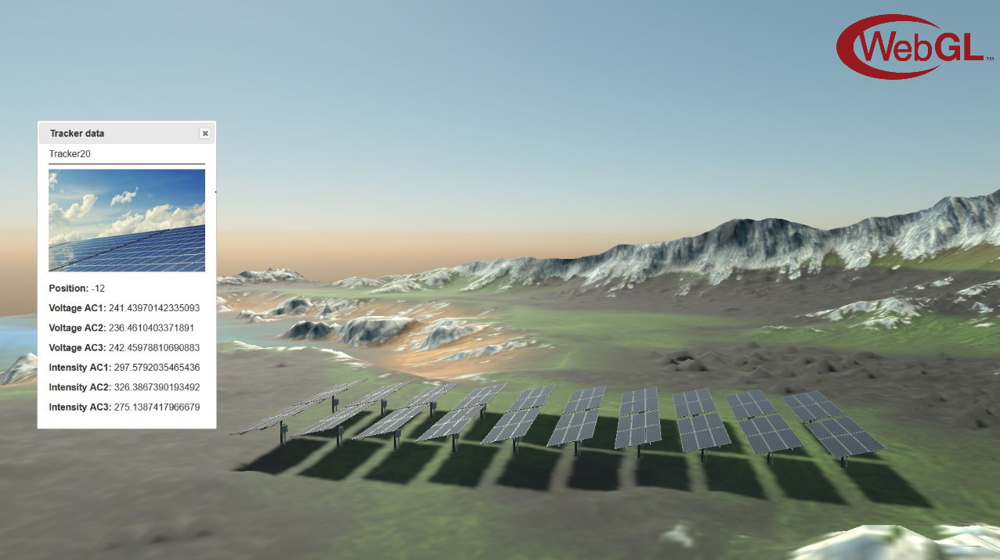

# Digital Twin Demo
Digital Twin application sample based on a solar energy field. It simulates a time lapse and how
users could check different measurements related to tracker angles, voltage or intensity.

### Live Demo: https://everginedigitaltwins.z6.web.core.windows.net/

## Build and Test
- Required Visual Studio 2022 with .NET6 support
- For web solution: [Web instructions](README.Web.md) 

### How to use
In web solution
 * **Left Click + Mouse**: Click on photovoltaic panels to open measurements dialog.

----
Powered by **[Evergine ](http://www.evergine.com)**

LET'S CONNECT!

- [Youtube](https://www.youtube.com/channel/UCpA-X92rxM0OuywdVcir9mA)
- [Twitter](https://twitter.com/EvergineTeam)
- [News](https://evergine.com/news/)
